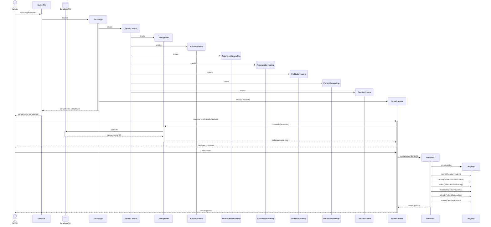
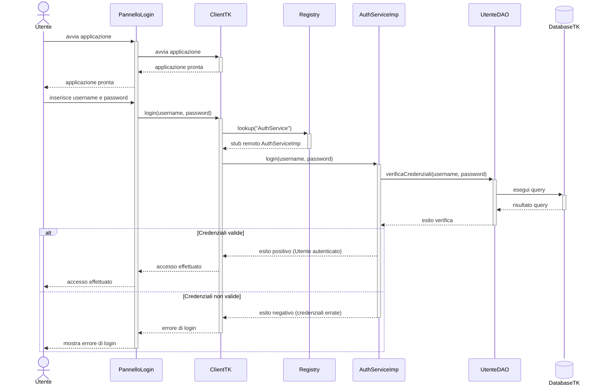

# Avvio server

```mermaid
sequenceDiagram
    actor Admin
    participant STK as ServerTK
    participant DB@{ "type": "database" } as DatabaseTK


    Admin->>+STK: avvia applicazione
    create participant SA as ServerApp
    STK->>+SA: launch

    create participant SC as ServerContext
    SA->>SC: create

    create participant MDB as ManagerDB
    SC->>MDB: create

    create participant auth as AuthServiceImp
    SC->>auth: create
    create participant recensioni as RecensioniServiceImp
    SC->>recensioni: create
    create participant ristoranti as RistorantiServiceImp
    SC->>ristoranti: create
    create participant profilo as ProfiloServiceImp
    SC->>profilo: create
    create participant preferiti as PreferitiServiceImp
    SC->>preferiti: create
    create participant geo as GeoServiceImp
    SC->>geo: create

    create participant PA as PannelloAdmin
    SA->>PA: mostra pannello

    SA-->>-STK: caricamento completato
    STK-->>-Admin: caricamento completato

    Admin->>+PA: inserisce credenziali database
    PA->>+MDB: connetti(credenziali)
    MDB->>+DB: connetti
    DB-->>-MDB: connessione OK
    MDB-->>-PA: database connesso
    PA-->>Admin: database connesso

    Admin->>PA: avvia server
    create participant SRMI as ServerRMI
    PA->>+SRMI: avvia(serverContext)

    create participant Registry
    SRMI->>Registry: crea registro

    SRMI->>Registry: rebind(AuthServiceImp)
    SRMI->>Registry: rebind(RecensioniServiceImp)
    SRMI->>Registry: rebind(RistorantiServiceImp)
    SRMI->>Registry: rebind(ProfiloServiceImp)
    SRMI->>Registry: rebind(PreferitiServiceImp)
    SRMI->>Registry: rebind(GeoServiceImp)

    SRMI-->>-PA: server pronto
    PA-->>-Admin: server pronto
```
# Login

```mermaid
sequenceDiagram
    actor Utente
    participant PL as PannelloLogin
    participant Client as ClientTK
    participant Reg as Registry
    participant Auth as AuthServiceImp
    participant UDAO as UtenteDAO
    participant DB@{ "type": "database" } as DatabaseTK


    Utente->>+PL: avvia applicazione
    PL->>+Client: avvia applicazione
    Client-->>-PL: applicazione pronta
    PL-->>Utente: applicazione pronta

    Utente->>PL: inserisce username e password
    PL->>+Client: login(username, password)

    Client->>+Reg: lookup("AuthService")
    Reg-->>-Client: stub remoto AuthServiceImp

    Client->>+Auth: login(username, password)
    Auth->>+UDAO: verificaCredenziali(username, password)
    UDAO->>+DB: esegui query
    DB-->>-UDAO: risultato query
    UDAO-->>-Auth: esito verifica

    alt Credenziali valide
        Auth-->>Client: esito positivo (Utente autenticato)
        Client-->>PL: accesso effettuato
        PL-->>Utente: accesso effettuato
    else Credenziali non valide
        Auth-->>-Client: esito negativo (credenziali errate)
        Client-->>-PL: errore di login
        PL-->>-Utente: mostra errore di login
    end
```

