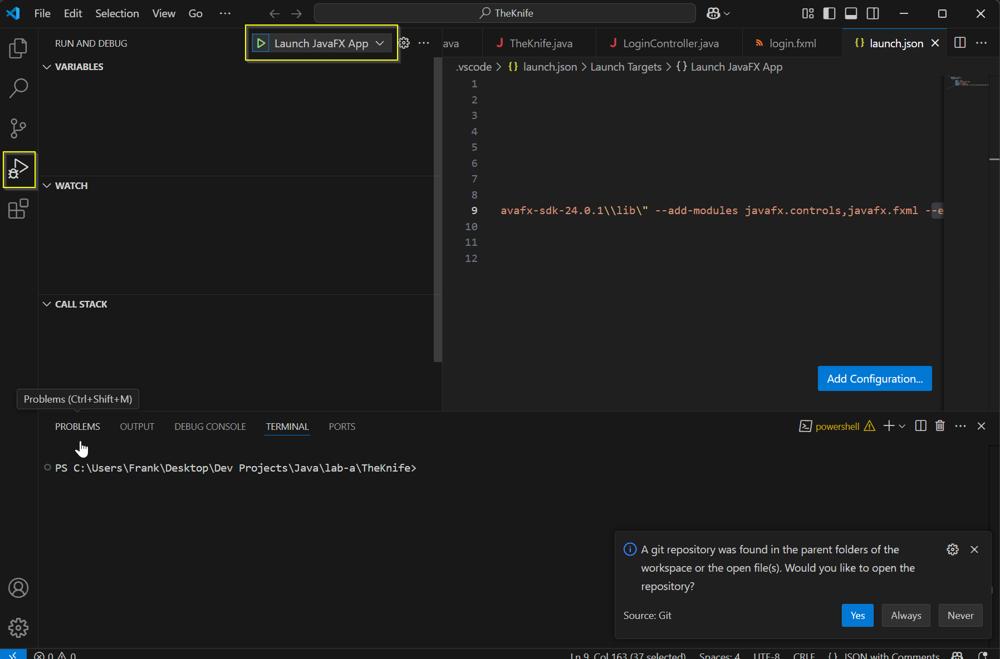

The Knife

CONFIGURAZIONE INIZIALE:

Per utilizzare il programma è necessario configurare javaFX. Passaggi:

1) Scaricare javaFX
2) Unzippare la cartella e copiare il percorso della cartella lib
3) Per visual studio code:
    - Aprire la cartella TheKnife del progetto
    - Andare su Run -> Add Configuration...
    - Viene creato un file launch.json nella cartella .vscode, modificarlo inserendo questo codice (sostituire <javaFX_path> con il percorso copiato al passaggio 2):

        ,{
            "type": "java",
            "name": "File corrente",
            "request": "launch",
            "mainClass": "${file}", //questo fa in modo di avviare il file attualmente aperto nell'editor di vscode
            "vmArgs": "--module-path <javaFX_path> --add-modules javafx.controls,javafx.fxml"
        }

nota 1: vedere il file di esempio "launch_ex.json" nella cartella principale del progetto come riferimento

4) Per avviare il programma o un'interfaccia bisogna aprire il relativo file java nell'editor, andare nella finestra Run & Debug (toolbar a sinistra in visual studio code) e selezionare "File corrente" (vedi immagine sotto)

MAVEN (WORK IN PROGRESS):

È necessario installare e configurare maven, seguendo questi passaggi:

1) scaricare il file .zip (sotto la cartella Link) qui: https://maven.apache.org/download.cgi
2) estrarre la cartella contenuta nel file zip
3) modificare/verificare variabili di sistema: 
- aggiungere alla variabile Path il percorso alla cartella bin, contenuta nella cartella estratta al passo 2 (ex: C:\Users\Pippo\Desktop\Dev Projects\Java\Maven\apache-maven-3.9.9\bin)
- creare una nuova variabile MAVEN_HOME e aggiungere il percorso alla cartella estratta, senza bin (ex: C:\Users\Pippo\Desktop\Dev Projects\Java\Maven\apache-maven-3.9.9)
- verificare che la variabile JAVA_HOME contenga un valore del tipo C:\Program Files\Java\jdk-24 (deve puntare alla cartella jdk, non alla cartella bin)

Avvio applicazione/interfacce:

1) Tramite launch.json:

- Aprire la cartella TheKnife-Maven
- Andare su "Run" -> Add configuration
- Modificare il file launch.json seguendo l'esempio launch_ex.json
- Aprire nell'editor il file desiderato, andare su "Run & Debug" e selezionare "File corrente"

2) Tramite comando da terminale:

- Configurare nel file pom il file da eseguire (ex: com.gruppo10.fileJava.Login) 
- Assicurarsi di essere nella cartella the_knife all'interno del terminale
- lanciare il comando "mvn javafx:run -f pom.xml"

------------------------------------------------------------------------------------------------------------------------------------------------------------------------

------------------------------------------------------------------------------------------------------------------------------------------------------------------------

PASSAGGI PER CONTRIBUIRE:

1) git fetch -> git status (verificare il branch attuale e se ci sono modifiche da pullare)
2) git pull (se necessario)
3) git checkout -b nome_branch (crea un nuovo branch, esempio: grafica/principale)
...
modifiche
...
4) git add -A (a fine modifiche)
5) git commit -m "messaggio" (ex: "aggiunta schermata principale")
6) git push origin nome_branch (aggiunge il branch creato a github)

Merge:
6) git checkout main
7) git merge nome_branch (se il branch è terminato)

Se ci sono dei conflitti (indicati dal terminale)ç

8) Risolvere i conflitti (modificare i file in conflitto)
9) git add .
10) git commit -m "merge main-nome_branch"

11) git branch -d nome_branch (se è stato eseguito il merge correttamente, il branch viene eliminato localmente)
12) git push origin --delete nome_branch (elimina il branch anche da github)

nota 1: è meglio aprire e chiudere tanti branch uguali, facendo spesso merge, in modo da ridurre il rischio di conflitti

nota 2: se si vuole testare il merge prima di effettuarlo seguire i seguenti passaggi: - creare un nuovo branch test-merge (questo "copia" il main attuale su un branch separato)
                                                                                       - eseguire il merge del branch desiderato sul test-merge
                                                                                       - risolvere eventuali conflitti
                                                                                       - infine eseguire il merge tra main e test-merge

Per lavorare su un branch specifico già esistente:

1) git fetch origin (aggiorna i riferimenti)
2) git branch -r (restituisce una lista dei branch attualmente presenti SU GITHUB, per vedere quelli in locale basta togliere "-r")
3) git checkout nome_branch ("sposta" l'utente sul branch desiderato)

nota: nella lista di branch, "origin/HEAD -> origin/main" indica che il branch di default (origin/HEAD) è impostato sul branch main (origin/main)

------------------------------------------------------------------------------------------------------------------------------------------------------------------------

SCRIPT TEST:

c'è un file test_gui.py che permette di testare tutte le finestre contenute in src/fileJava, per farlo funzionare è necessario creare un file private_keys.py e inserire la variabile javafx_path contenente il proprio percorso alla cartella lib di javafx

nota: seguire il file di esempio "private_keys_ex.py"

------------------------------------------------------------------------------------------------------------------------------------------------------------------------

GRAFICA:

Font/font-size:

- label -> System 18px
- button -> System 14px
- testo mini -> System 12px

------------------------------------------------------------------------------------------------------------------------------------------------------------------------

TO DO:

- aggiungere test a gitignore (FATTO)
- modificare test (FATTO)
- creare classi: - Ristorante
                 - Utente
                 - listaRistoranti(?)
                 - listaUtenti(?)
                 - eventuali
- capire come gestire i file csv
- creare dialog: - aggiungere un ristorante
                 - modificare dati personali
- 
------------------------------------------------------------------------------------------------------------------------------------------------------------------------

LOG MODIFICHE:

18-04-2025: fgirlanda -> - riorganizzazione readme + esempio.json 
                         - modifica struttura src
                         - creazione profilo_cliente.fxml nel branch grafica/profilo_cliente

19-04-2025: fgirlanda -> - modifica a file LoginController, Login, Registrazione
                         - collegamento bottone registrati -> apertura finestra registrazione
                         - creazione file TheKnife (principale)

19-04-2025: matlmbe  -> - creazione RegistazioneController
                        - assegnazione id radiobutton
                        - toggle-goup radiobutton

23-04-2025 fgirlanda -> - creazione controller per profili e pagina ristorante
                        - creazione file java per profili e pagina ristorante

24-04-2025 matlmbe   -> - creazione ultime pagine
                        - creazione ultimi controller

25-04-2025 fgirlanda -> - creazione test_gui.py
                        - riorganizzazione file fxml

29-04-2025 fgirlanda -> - modifica test_gui.py
                        - creazione private_keys.py

29-04-2025 matlmbe   -> - creazione prime classi
                        - adattamento struttura con camelCase

30-04-2025 fgirlanda -> - inizio bottoni cambio_pagina (da finire)

01-05-2025 fgirlanda -> - inizio passaggio a maven (creazione struttura e setup iniziale pom)
                        - aggiornamento readme con sezione maven

------------------------------------------------------------------------------------------------------------------------------------------------------------------------
Progetto di laboratorio per Università degli studi dell'Insubria, corso di Informatica, a cura di Girlanda Francesco e Lambertoni Mattia.

Il progetto è ancora in fase di progettazione, è disponibile il documento relativo, in lavorazione, scritto in Latex (formato tex)

Link per visualizzare e modificare il documento di progettazione: https://it.overleaf.com/6875229844vtytrbxfcyzc#8e5919

