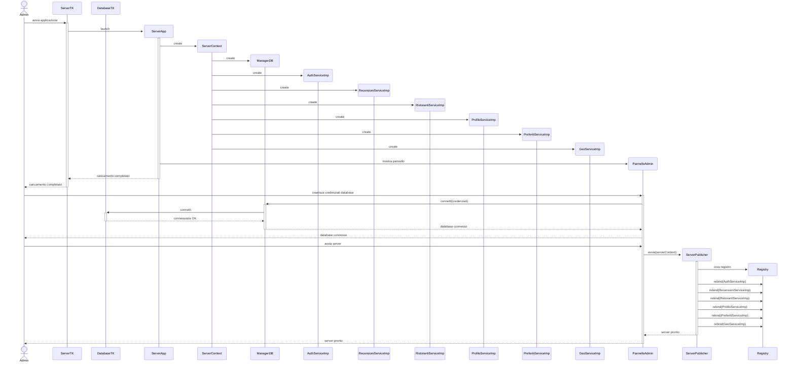
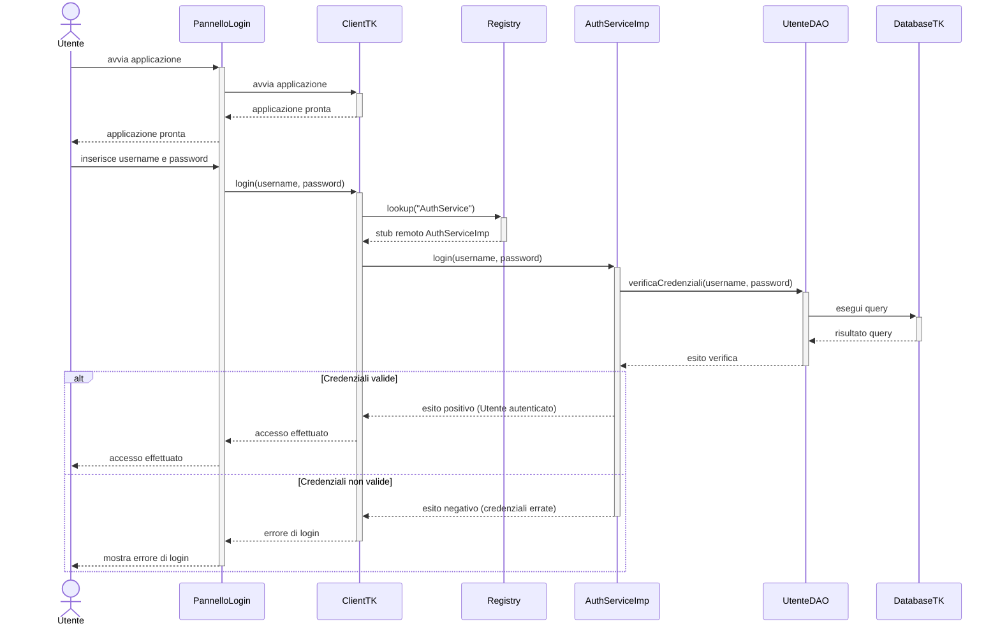

# The Knife

The Knife è un progetto universitario sviluppato per il corso di Informatica presso l'Università degli Studi dell'Insubria. Il sistema combina JavaFX, Java, Maven e PostgreSQL per offrire un'applicazione completa per la ricerca, la gestione e la recensione di ristoranti.

Autori:
- Girlanda Francesco
- Lambertoni Mattia
- Gallon Gabriele

---

## Panoramica

Il progetto è organizzato in tre moduli principali:

- client: interfaccia grafica e logica di presentazione;
- server: backend, gestione servizi remoti e coordinamento dell'applicazione;
- common: classi condivise, DTO, modelli ed elementi comuni.

### Funzionalità principali

- registrazione e login utenti;
- ricerca e filtri ristoranti;
- gestione dei preferiti;
- aggiunta, modifica e rimozione recensioni;
- gestione del profilo personale;
- pannello amministrativo per la connessione al database e l'avvio del server.

### Stack tecnologico

- Java 24
- JavaFX 24.0.1
- Maven 3.9.9
- PostgreSQL 18.4
- Git

---

## Requisiti e prerequisiti

Prima di iniziare, verificare che nel sistema siano installati:

- Java JDK 24.0.2
- JavaFX 24.0.1
- Apache Maven 3.9.9
- PostgreSQL 18.4
- Git

Controllare la corretta configurazione con:

```bash
java -version
mvn -version
psql --version
```

---

## Guida all'installazione

### 1. Clonare il repository

```bash
git clone <url-del-repository>
cd The-Knife
```

### 2. Installare Maven

Scaricare Maven dalla pagina ufficiale:

https://maven.apache.org/download.cgi

Configurazione tipica su Windows:

```text
Path: C:\Users\Pippo\Desktop\Dev Projects\Java\Maven\apache-maven-3.9.9\bin
MAVEN_HOME: C:\Users\Pippo\Desktop\Dev Projects\Java\Maven\apache-maven-3.9.9
JAVA_HOME: C:\Program Files\Java\jdk-24
```

### 3. Preparare il database

1. Installare PostgreSQL.
2. Creare un database locale.
3. Eseguire lo script SQL presente nella root del progetto:

```bash
psql -U postgres -f TheKnife.sql
```

### 4. Compilare il progetto

```bash
mvn install
```

Questo comando genera i jar dei moduli e compila l'intero progetto.

---

## Avvio dell'applicazione

### Modalità 1: tramite VS Code

1. Aprire il progetto in VS Code.
2. Usare la configurazione di esempio presente in `launch_ex.json`.
3. Avviare prima il server e poi il client.
4. Collegarsi al database tramite il pannello admin.
5. Avviare il servizio server e successivamente la UI client.

### Modalità 2: tramite terminale

Terminale server:

```bash
mvn -f server/pom.xml javafx:run
```

Terminale client:

```bash
mvn -f client/pom.xml javafx:run
```

### Modalità 3: tramite JAR

Dopo la build, i file eseguibili sono generati in:

- server/target/server-2.0-SNAPSHOT.jar
- client/target/client-2.0-SNAPSHOT.jar

Procedura consigliata:

1. avviare il server;
2. collegarsi al database;
3. avviare il backend;
4. avviare il client.

---

## Struttura del progetto

```text
The-Knife/
├── client/                  # interfaccia grafica JavaFX
├── common/                  # modelli e classi condivise
├── server/                  # backend e servizi remoti
├── data/                    # file CSV e log
├── Documentazione/          # manuali e UML
├── README.md                # documentazione principale
├── TheKnife.sql             # script database
├── pom.xml                  # build del progetto
├── launch_ex.json           # esempio configurazione avvio
├── LICENSE
└── .gitignore
```

---

## Moduli del progetto

- [client/README.md](client/README.md) — descrizione dell'applicazione client e delle sue funzionalità.
- [server/README.md](server/README.md) — descrizione del backend, del database e del pannello admin.
- [common/README.md](common/README.md) — descrizione delle classi e dei modelli condivisi.

---

## Contribuire al progetto

Per contribuire, è consigliato lavorare sempre su un branch dedicato invece di modificare direttamente `main`.

### Workflow consigliato

```bash
git fetch
git status
git checkout -b nome_branch
```

Dopo aver completato la modifica:

```bash
git add -A
git commit -m "Descrizione chiara del commit"
git push origin nome_branch
```

### Merge di un branch

```bash
git checkout main
git merge nome_branch
```

Se compaiono conflitti:

1. aprire i file coinvolti;
2. risolvere manualmente i conflitti;
3. aggiungere i file corretti;
4. completare il merge con un commit.

### Branch già esistenti

```bash
git fetch origin
git checkout nome_branch
```

> Consiglio: mantenere branch piccoli e tematici per ridurre i conflitti e semplificare il controllo delle modifiche.

---

## Documentazione e UML

La cartella [Documentazione](Documentazione) contiene i documenti e i diagrammi del progetto.

In particolare, la cartella [Documentazione/UML](Documentazione/UML) raccoglie i file di analisi e i diagrammi di sequenza dedicati all'avvio del server e al login.

### Diagrammi UML principali


```mermaid
sequenceDiagram
    actor Admin
    participant STK as ServerTK
    participant DB as DatabaseTK

    Admin->>+STK: avvia applicazione
    create participant SA as ServerApp
    STK->>+SA: launch

    create participant SC as ServerContext
    SA->>SC: create

    create participant MDB as ManagerDB
    SC->>MDB: create

    create participant auth as AuthServiceImp
    SC->>auth: create
    create participant recensioni as RecensioniServiceImp
    SC->>recensioni: create
    create participant ristoranti as RistorantiServiceImp
    SC->>ristoranti: create
    create participant profilo as ProfiloServiceImp
    SC->>profilo: create
    create participant preferiti as PreferitiServiceImp
    SC->>preferiti: create
    create participant geo as GeoServiceImp
    SC->>geo: create

    create participant PA as PannelloAdmin
    SA->>PA: mostra pannello
    SA-->>-STK: caricamento completato
    STK-->>-Admin: caricamento completato

    Admin->>+PA: inserisce credenziali database
    PA->>+MDB: connetti(credenziali)
    MDB->>+DB: connetti
    DB-->>-MDB: connessione OK
    MDB-->>-PA: database connesso
    PA-->>Admin: database connesso

    Admin->>PA: avvia server
    create participant SRMI as ServerPublisher
    PA->>+SRMI: avvia(serverContext)

    create participant Registry
    SRMI->>Registry: crea registro
    SRMI->>Registry: rebind(AuthServiceImp)
    SRMI->>Registry: rebind(RecensioniServiceImp)
    SRMI->>Registry: rebind(RistorantiServiceImp)
    SRMI->>Registry: rebind(ProfiloServiceImp)
    SRMI->>Registry: rebind(PreferitiServiceImp)
    SRMI->>Registry: rebind(GeoServiceImp)

    SRMI-->>-PA: server pronto
    PA-->>-Admin: server pronto
```


```mermaid
sequenceDiagram
    actor Utente
    participant PL as PannelloLogin
    participant Client as ClientTK
    participant Reg as Registry
    participant Auth as AuthServiceImp
    participant UDAO as UtenteDAO
    participant DB as DatabaseTK

    Utente->>+PL: avvia applicazione
    PL->>+Client: avvia applicazione
    Client-->>-PL: applicazione pronta
    PL-->>Utente: applicazione pronta

    Utente->>PL: inserisce username e password
    PL->>+Client: login(username, password)

    Client->>+Reg: lookup("AuthService")
    Reg-->>-Client: stub remoto AuthServiceImp

    Client->>+Auth: login(username, password)
    Auth->>+UDAO: verificaCredenziali(username, password)
    UDAO->>+DB: esegui query
    DB-->>-UDAO: risultato query
    UDAO-->>-Auth: esito verifica

    alt Credenziali valide
        Auth-->>Client: esito positivo (Utente autenticato)
        Client-->>PL: accesso effettuato
        PL-->>Utente: accesso effettuato
    else Credenziali non valide
        Auth-->>-Client: esito negativo (credenziali errate)
        Client-->>-PL: errore di login
        PL-->>-Utente: mostra errore di login
    end
```

Ulteriori riferimenti:

- [Documentazione/UML/Sequence.md](Documentazione/UML/Sequence.md)
- [Documentazione/UML/TK_Sequence_AvvioServer.mmd](Documentazione/UML/TK_Sequence_AvvioServer.mmd)
- [Documentazione/UML/TK_Sequence_Login.mmd](Documentazione/UML/TK_Sequence_Login.mmd)

---

## TODO

### ilTacco

- Criptare password (FATTO)
- Leggere file csv (FATTO)
- Aggiungere id al cliente (FATTO)
- Implementare nell'interfaccia (dati errati, utente inesistente, login effettuato) (FATTO)
- Collegare tasto login a pagina principale (FATTO)
- Utente loggato (FATTO)
- Username univoco (FATTO)
- Visualizzazione del profilo (FATTO)
- Login senza registrazione (+disabilita tasto preferiti) (FATTO)
- Visualizza miei ristoranti (FATTO)
- Ottimizzazione (FATTO)
- Immagini ristoranti (FATTO)

### matlmbe

- File csv ristoranti (FATTO)
- Dialog per aggiungere (FATTO)
- Inserire card ristorante nella pagina principale (FATTO)
- Gestire ricerca e filtri (FATTO)
- Ristoranti preferiti (FATTO)
- Sistemare card ristorante (FATTO)
- Tasto filtro distanza (FATTO)
- Tasto indietro pagina ristorante (FATTO)
- Tasto-pagina aggiungi recensione (FATTO)
- Card apribile (FATTO)
- Card recensione (FATTO)
- Documentazione

### fgirlanda

- Trova ristoranti vicini (FATTO)
- Gestire posizione utente/ristorante (FATTO)
- Calcola distanza (FATTO)
- Recensioni (file csv, classi) (FATTO)
- Sistemare tipo cucina csv (FATTO)
- Sfoltire ristoranti (50 - nomi corti - proprietario - id da 1) (FATTO)
- Funzione filtro distanza (FATTO)
- Fixare abilita/disabilita pulsanti (FATTO)
- Ultimi fix (FATTO)

### Generale

- File csv con coppie id utente-ristorante_preferito/recensioni (FATTO)
- ID a ristoranti e recensioni (FATTO)
- CSV recensioni (FATTO)
- Gestione ristorante aperto (FATTO)
- Rimozione recensione (FATTO)
- Modifica recensione (FATTO)
- Numero di recensioni (FATTO)
- Modificare filtri ricerca ristoranti (FATTO)
- Calcolo media recensioni modificate (FATTO)
- Disabilitare bottone risposta recensione dopo aver risposto (FATTO)
- Rendere visibile la risposta (FATTO)

### Grafica

- Fix dimensione finestra profilo (FATTO)
- Fix login status (popup al posto di label?)
- Modificare filtri ricerca ristoranti (FATTO)
- Immagini ristoranti legate a tipo cucina (FATTO)
- Nomi ristoranti in le mie recensioni (al posto di username) (FATTO)
- Fix spazio vuoto in le mie recensioni (FATTO)
- Fix bordo recensioni (FATTO)

### Pulizia codice

- Writer e Reader non sono coerenti tra di loro (alcuni hanno metodi static altri no) (FATTO)
- Classe astratta Controller (FATTO)
- Classe astratta CSVHandler (FATTO)
- Gestione eccezioni (FATTO)
- Generalizzazione dei percorsi file (FATTO)

### Issues

- L'utente può non selezionare un indirizzo generato dalla ricerca con nominatim e il programma funziona ugualmente perchè lat non è null (RISOLTO)
- Non aggiorna la recensione se si modifica solo il voto (RISOLTO)
- Rotta la modifica/rimozioni di recensioni per il calcolo media (RISOLTO)
- Stesso problema di modifica recensioni, ma solo dopo la prima modifica (RISOLTO)
- Non funziona rispondere a una recensione, il tasto non si disabilita e la risposta non appare (RISOLTO)
- Se aggiungo una recensione, non la posso modificare (RISOLTO)
- Errore caricamento card recensioni in profilo cliente, perchè le recensioni caricate non hanno il ristorante settato (RISOLTO)

### Extra

- Whitelist caratteri (opzionale)
- Soluzione per ripetizione metodo caricaTessere (FATTO)
- Pulizia grafica (FATTO)
- Aggiungere controllo indirizzo (FATTO)

### Ottimizzazioni

- Calcolo media per un ristorante quando viene rimossa una recensione prevede .remove da Lista, che ha complessità O(n), si potrebbe usare un contatore(?)

---

## LAB-B

### TODO

- interaction diagram
- package diagram
- ER diagram (FATTO)
- class diagram
- implementare DB (FATTO)
- creare GUI pannello admin
- use-case
- sequence
- ottimizzare gestione DB (FATTO)
- organizzare cartelle client-server (FATTO)
- fixare problemi dovuti a divisione in moduli separati (FATTO)
- implementare avvio server (FATTO)
- gestione permessi (FATTO)
- standardizzare il codice (FATTO)
- activity diagram
- aggiustare istruzioni installazione (FATTO)
- aggiungere istruzioni DB (FATTO)
- distribuzione client/server/database su macchine diverse
- aggiornamento GUI in risposta a eventi client - in corso 
- documentazione manuale utente e tecnico
- javadoc (FATTO)

---

## Documentazione aggiuntiva

- [Documentazione](Documentazione)
- [Documentazione/UML](Documentazione/UML)
- [TheKnife.sql](TheKnife.sql)
- [launch_ex.json](launch_ex.json)
