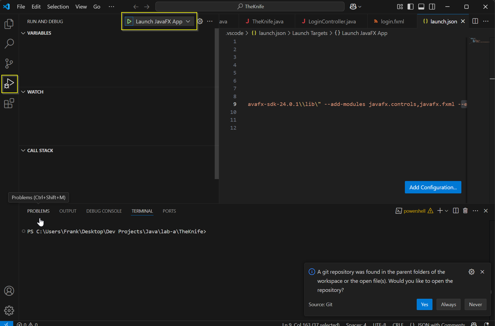

# The Knife

Progetto di laboratorio per Università degli studi dell'Insubria, corso di Informatica, a cura di Girlanda Francesco, Lambertoni Mattia e Gallon Gabriele.

## CONFIGURAZIONE INIZIALE

Per utilizzare il programma è necessario configurare javaFX. Passaggi:

1) Scaricare javaFX
2) Unzippare la cartella e copiare il percorso della cartella lib

## MAVEN

### Installazione

1) scaricare il file .zip (sotto la cartella Link) qui: https://maven.apache.org/download.cgi
2) estrarre la cartella contenuta nel file zip
3) modificare/verificare variabili di sistema: 
- aggiungere alla variabile Path il percorso alla cartella bin, contenuta nella cartella estratta al passo 2 (ex: C:\Users\Pippo\Desktop\Dev Projects\Java\Maven\apache-maven-3.9.9\bin)
- creare una nuova variabile MAVEN_HOME e aggiungere il percorso alla cartella estratta, senza bin (ex: C:\Users\Pippo\Desktop\Dev Projects\Java\Maven\apache-maven-3.9.9)
- verificare che la variabile JAVA_HOME contenga un valore del tipo C:\Program Files\Java\jdk-24 (deve puntare alla cartella jdk, non alla cartella bin)

### Avvio applicazione

1) Tramite launch.json:

- Andare su "Run" -> Add configuration
- Modificare il file launch.json seguendo l'esempio launch_ex.json (sostituire il path a javafx con quello copiato al passaggio 2 della configurazione di javafx)
- "File corrente" avvia il file attualmente aperto nell'editor, "The Knife" avvia il file TheKnife.java

2) Tramite comando da terminale:

- Assicurarsi di essere nella cartella principale (The-Knife) all'interno del terminale
- lanciare il comando "mvn javafx:run -f pom.xml"

### Compilazione e generazione jar+javadoc

1) Eseguire il comando "mvn clean compile"
2) Eseguire il comando "mvn package"

## PASSAGGI PER CONTRIBUIRE:

1) git fetch -> git status (verificare il branch attuale e se ci sono modifiche da pullare)
2) git pull (se necessario)
3) git checkout -b nome_branch (crea un nuovo branch, esempio: grafica/principale)
...
modifiche
...
4) git add -A (a fine modifiche, -A = aggiungi tutto, in alternativa aggiungere solo i file modificati)
5) git commit -m "messaggio" (ex: "aggiunta schermata principale")
6) git push origin nome_branch (aggiunge il branch creato a github)

Merge:
6) git checkout main
7) git merge nome_branch (se il branch è terminato)

Se ci sono dei conflitti (indicati dal terminale):

8) Risolvere i conflitti (modificare i file in conflitto)
9) git add .
10) git commit -m "merge main-nome_branch"

11) git branch -d nome_branch (se è stato eseguito il merge correttamente, il branch viene eliminato localmente)
12) git push origin --delete nome_branch (elimina il branch anche da github)

nota 1: è meglio aprire e chiudere tanti branch uguali, facendo spesso merge, in modo da ridurre il rischio di conflitti

nota 2: se si vuole testare il merge prima di effettuarlo seguire i seguenti passaggi: - creare un nuovo branch test-merge (questo "copia" il main attuale su un branch separato)
                                                                                       - eseguire il merge del branch desiderato sul test-merge
                                                                                       - risolvere eventuali conflitti
                                                                                       - infine eseguire il merge tra main e test-merge

Per lavorare su un branch specifico già esistente:

1) git fetch origin (aggiorna i riferimenti)
2) git branch -r (restituisce una lista dei branch attualmente presenti SU GITHUB, per vedere quelli in locale basta togliere "-r")
3) git checkout nome_branch ("sposta" l'utente sul branch desiderato)

nota: nella lista di branch, "origin/HEAD -> origin/main" indica che il branch di default (origin/HEAD) è impostato sul branch main (origin/main)

## TO DO:

### ilTacco:

- Criptare password (FATTO)
- Leggere file csv (FATTO)
- Aggiungere id al cliente (FATTO)
- Implementare nell'interfaccia (dati errati, utente inesistente, login effettuato) (FATTO)
- Collegare tasto login a pagina principale (FATTO)
- Utente loggato (FATTO)
- Username univoco (FATTO)
- Visualizzazione del profilo (FATTO)
- Login senza registrazione (+disabilita tasto preferiti) (FATTO)
- Visualizza miei ristoranti (FATTO)
- Ottimizzazione (FATTO)
- Immagini ristoranti (FATTO)

### matlmbe:

- File csv ristoranti (FATTO)
- Dialog per aggiungere (FATTO)
- Inserire card ristorante nella pagina principale (FATTO)
- Gestire ricerca e filtri (FATTO)
- Ristoranti preferiti (FATTO)
- Sistemare card ristorante (FATTO)
- Tasto filtro distanza (FATTO)
- Tasto indietro pagina ristorante (FATTO)
- Tasto-pagina aggiungi recensione (FATTO)
- Card apribile (FATTO)
- Card recensione (FATTO)
- Documentazione

### fgirlanda:

- Trova ristoranti vicini (FATTO)
- Gestire posizione utente/ristorante (FATTO)
- Calcola distanza (FATTO)
- Recensioni (file csv, classi) (FATTO)
- Sistemare tipo cucina csv (FATTO)
- Sfoltire ristoranti (50 - nomi corti - proprietario - id da 1) (FATTO)
- Funzione filtro distanza (FATTO)
- Fixare abilita/disabilita pulsanti  (FATTO)
- Ultimi fix (FATTO)

### Generale

Generale:

- File csv con coppie id utente-ristorante_preferito/recensioni (FATTO)
- ID a ristoranti e recensioni (FATTO)

- CSV recensioni (FATTO)

    - ID recensione
    - ID cliente
    - ID ristorante
    - Voto
    - Testo
    - Risposta

- Gestione ristorante aperto (FATTO)
- Rimozione recensione (FATTO)
- Modifica recensione (FATTO)
- Numero di recensioni (FATTO)
- Modificare filtri ricerca ristoranti (FATTO)
- Calcolo media recensioni modificate (FATTO)
- Disabilitare bottone risposta recensione dopo aver risposto (FATTO)
- Rendere visibile la risposta (FATTO)

Grafica:

- Fix dimensione finestra profilo (FATTO)
- Fix login status (popup al posto di label?) 
- Modificare filtri ricerca ristoranti (FATTO)
- Immagini ristoranti legate a tipo cucina (FATTO)
- Nomi ristoranti in le mie recensioni (al posto di username) (FATTO)
- Fix spazio vuoto in le mie recensioni (FATTO)
- Fix bordo recensioni (FATTO)

Pulizia codice:

- Writer e Reader non sono coerenti tra di loro (alcuni hanno metodi static altri no) (FATTO)
- Classe astratta Controller (FATTO)
- Classe astratta CSVHandler (FATTO)
- Gestione eccezioni (FATTO)
- Generalizzazione dei percorsi file (FATTO)

Issues:

- L'utente può non selezionare un indirizzo generato dalla ricerca con nominatim e il programma funziona ugualmente perchè lat non è null (per esempio indirizzo: mario) (RISOLTO)
- Non aggiorna la recensione se si modifica solo il voto (RISOLTO)
- Rotta la modifica/rimozioni di recensioni per il calcolo media - probabile causa: manca l'assegnazione del ristorante alla recensione in alcuni punti (RISOLTO)
- Stesso problema di modifica recensioni, ma solo dopo la prima modifica, che funziona correttamente (RISOLTO)
- Non funziona rispondere a una recensione, il tasto non si disabilita e la risposta non appare (RISOLTO)
- Se aggiungo una recensione, non la posso modificare (RISOLTO)
- Errore caricamento card recensioni in profilo cliente, perchè le recensioni caricate non hanno il ristorante settato (RISOLTO)

Extra:

- Whitelist caratteri (opzionale)
- Soluzione per ripetizione metodo caricaTessere (FATTO)
- Pulizia grafica (FATTO)
- Aggiungere controllo indirizzo (FATTO)

Ottimizzazioni:

- Calcolo media per un ristorante quando viene rimossa una recensione prevede .remove da Lista, che ha complessità O(n), si potrebbe usare un contatore(?)