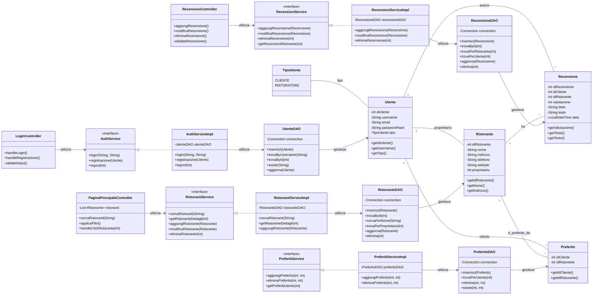
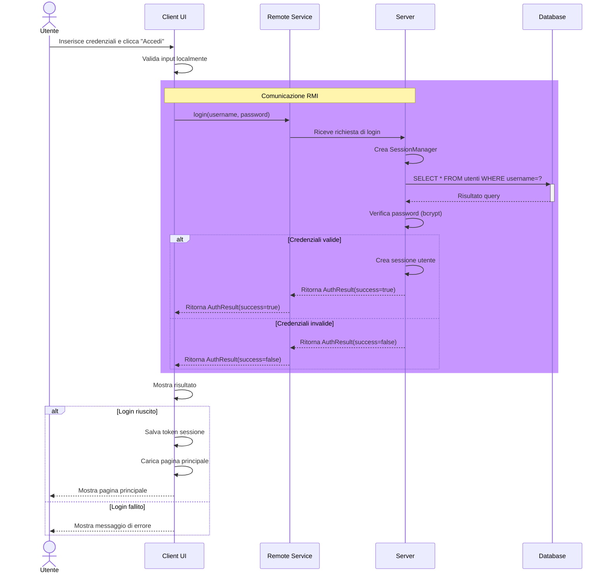
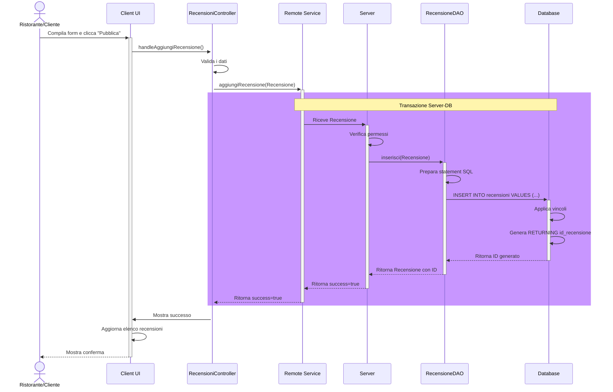
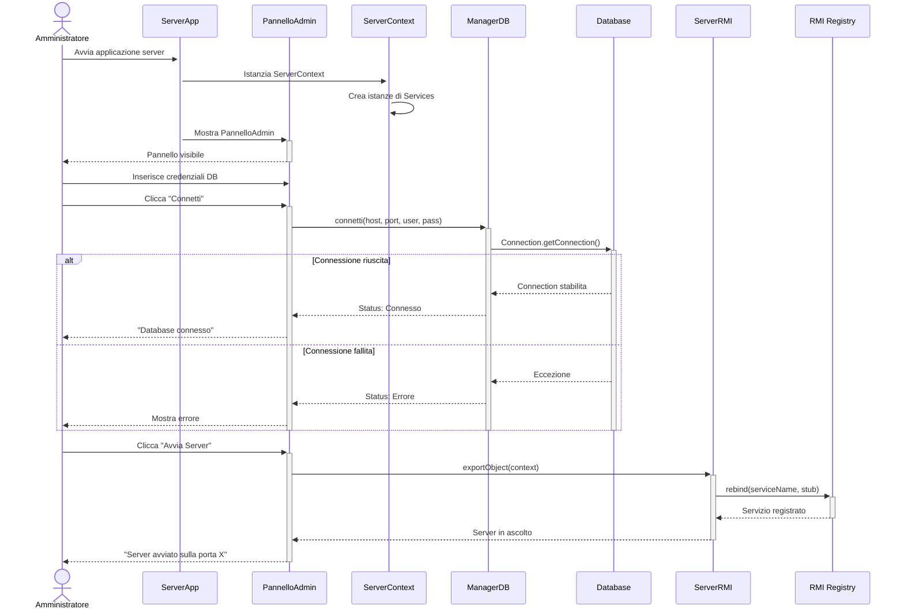
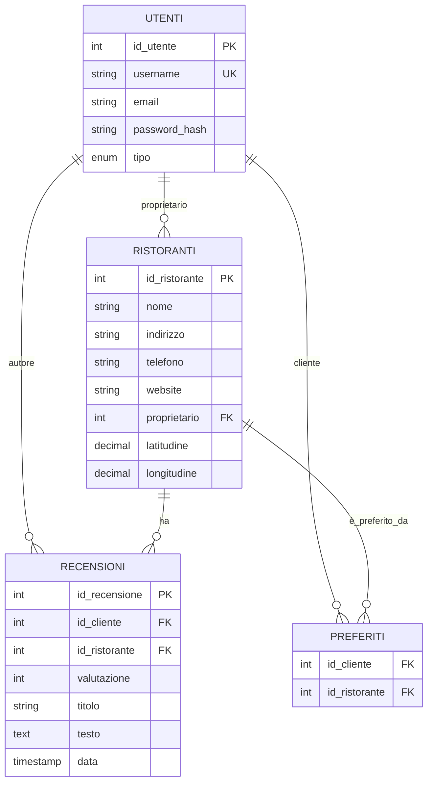

# MANUALE TECNICO – THE KNIFE

**Università degli Studi dell'Insubria**  
Dipartimento di Scienze Teoriche e Applicate  
Laboratorio Interdisciplinare B

---

## Frontespizio

**Titolo:** The Knife - Documentazione Tecnica Sistema di Gestione Ristoranti  
**Versione Documento:** 1.0  
**Data:** Agosto 2025  

**Autori:**
- Girlanda Francesco
- Lambertoni Mattia
- Gallon Gabriele

---

## Indice

1. [Introduzione](#introduzione)
2. [Architettura del Sistema](#architettura-del-sistema)
3. [Progettazione](#progettazione)
   - [Diagramma delle Classi](#diagramma-delle-classi)
   - [Diagrammi di Sequenza](#diagrammi-di-sequenza)
   - [Design Patterns](#design-patterns)
4. [Strutture Dati](#strutture-dati)
5. [Database](#database)
   - [Schema ER](#schema-er)
   - [Vincoli e Relazioni](#vincoli-e-relazioni)
6. [Scelte Architetturali](#scelte-architetturali)
7. [Stack Tecnologico](#stack-tecnologico)
8. [Guida all'Implementazione](#guida-allimplementazione)
9. [Sitografia e Bibliografia](#sitografia-e-bibliografia)

---

## Introduzione

**The Knife** è un'applicazione multi-tier per la gestione e la recensione di ristoranti, sviluppata con un'architettura **client-server** che separa la logica di presentazione dalla logica di business e dall'accesso ai dati.

Il progetto dimostra:
- Utilizzo di pattern architetturali (DAO, MVC)
- Comunicazione remota tramite RMI (Remote Method Invocation)
- Persistenza dei dati su database relazionale PostgreSQL
- Interfaccia grafica moderna con JavaFX
- Gestione di autenticazione e autorizzazione
- Implementazione di operazioni CRUD complete

---

## Architettura del Sistema

### Architettura Generale

The Knife segue un'architettura **client-server multi-tier** divisa in tre componenti principali:

```
┌─────────────────┐         RMI         ┌──────────────────┐         SQL         ┌──────────────┐
│   CLIENT        │◄─────────────────►  │     SERVER       │◄─────────────────►  │   DATABASE   │
│  (Presentazione)│                     │   (Business)     │                     │  (Dati)      │
└─────────────────┘                     └──────────────────┘                     └──────────────┘
      JavaFX                                    Java                            PostgreSQL
    Controllers                            Services + RMI                        Tables & Views
      Models                               DAO Pattern
```

### Moduli del Progetto

#### 1. **Client Module** (`client/`)
- Interfaccia utente sviluppata in **JavaFX**
- Controllers per la gestione della logica di presentazione
- Models per la rappresentazione locale dei dati
- Comunicazione con il server tramite RMI
- Struttura:
  ```
  client/
  ├── README.md                
  ├── pom.xml
  ├── dependency-reduced-pom.xml
  ├── src/main/java/com/gruppo10/
  │   ├── controller/               # Controller JavaFX
  │   ├── gui_elements/             # Utility grafica
  │   ├── ClientContext.java/       # Contesto client
  │   ├── ClientTK.java/            # Applicazione
  │   └── ClientBoot.java           # Entry point
  └── src/main/resources/
      ├── images                    # Immagini GUI
      └── GUI/                      # FXML (interfacce)
  ```

#### 2. **Server Module** (`server/`)
- Logica di business e servizi remoti
- Implementazione dei Service (tramite RMI)
- Data Access Objects (DAO) per accesso ai dati
- Autenticazione e autorizzazione
- Gestione della connessione al database
- Struttura:
  ```
  server/
  ├── README.md                
  ├── pom.xml
  ├── dependency-reduced-pom.xml
  ├── src/main/java/com/gruppo10/
  │   ├── servizi_imp/              # Servizi remoti
  │   ├── database/                 # Data Access Objects
  │   ├── controller/               # Controller JavaFX
  │   ├── permessi/                 # Gestione permessi
  │   ├── ServerBoot.java           # Entry point
  │   ├── ServerContext.java        # Contesto server
  │   ├── ServerPublisher.java      # Pubblicazione dei servizi
  │   └── ServerTK.java             # Applicazione
  └── src/main/resources/
      ├── images                    # Immagini GUI
      └── GUI/                      # Pannello amministrativo
  ```

#### 3. **Common Module** (`common/`)
- Classi condivise tra client e server
- Data Transfer Objects (DTO)
- Interfacce remote per RMI
- Modelli comuni
- Struttura:
  ```
  common/
  ├── src/main/java/com/gruppo10/
  │   ├── classi/              # Modelli comuni
  │   ├── servizi_int/         # Interfacce remote
  │   └── eccezioni/           # Eccezioni comuni
  ```

---

## Progettazione

### Diagramma delle Classi - Sistema Completo



### Diagramma di Sequenza - Login



### Diagramma di Sequenza - Aggiunta Recensione



### Diagramma di Sequenza - Avvio Server



### Design Patterns

#### 1. **Data Access Object (DAO) Pattern**

Ogni entità ha un corrispondente DAO che gestisce l'accesso ai dati:

```java
public class UtenteDAO {
    private Connection connection;
    
    public void inserisci(Utente utente) throws SQLException {
        String sql = "INSERT INTO utenti (username, email, password_hash, tipo) VALUES (?, ?, ?, ?)";
        try (PreparedStatement stmt = connection.prepareStatement(sql, Statement.RETURN_GENERATED_KEYS)) {
            stmt.setString(1, utente.getUsername());
            stmt.setString(2, utente.getEmail());
            stmt.setString(3, hashPassword(utente.getPassword()));
            stmt.setString(4, utente.getTipo().toString());
            
            int affectedRows = stmt.executeUpdate();
            if (affectedRows == 0) throw new SQLException("Inserimento fallito");
            
            try (ResultSet generatedKeys = stmt.getGeneratedKeys()) {
                if (generatedKeys.next()) {
                    utente.setIdUtente(generatedKeys.getInt(1));
                }
            }
        }
    }
    
    public Utente trovaByUsername(String username) throws SQLException {
        String sql = "SELECT * FROM utenti WHERE username = ?";
        try (PreparedStatement stmt = connection.prepareStatement(sql)) {
            stmt.setString(1, username);
            try (ResultSet rs = stmt.executeQuery()) {
                if (rs.next()) {
                    return mapResultSetToUtente(rs);
                }
            }
        }
        return null;
    }
}
```

**Vantaggi:**
- Separazione tra logica di business e accesso ai dati
- Facilita i test unitari (mockaggio dei DAO)
- Centralizza le query SQL
- Facilita la manutenzione

#### 2. **Service Layer Pattern**

I servizi implementano la logica di business e sono esposti tramite RMI:

```java
public interface AuthService extends Remote {
    AuthResult login(String username, String password) throws RemoteException;
    AuthResult registrazione(Utente utente) throws RemoteException;
    void logout(int idUtente) throws RemoteException;
}

public class AuthServiceImpl extends UnicastRemoteObject implements AuthService {
    private UtenteDAO utenteDAO;
    private SessionManager sessionManager;
    
    public AuthResult login(String username, String password) throws RemoteException {
        try {
            Utente utente = utenteDAO.trovaByUsername(username);
            if (utente != null && verificaPassword(password, utente.getPasswordHash())) {
                int sessionId = sessionManager.creaSessione(utente.getIdUtente());
                return new AuthResult(true, "Login riuscito", sessionId, utente);
            }
            return new AuthResult(false, "Credenziali invalide", -1, null);
        } catch (SQLException e) {
            return new AuthResult(false, "Errore database", -1, null);
        }
    }
}
```

**Vantaggi:**
- Logica di business centralizzata
- Facile da testare
- Facilita il riuso del codice
- Separazione delle responsabilità

#### 3. **Model-View-Controller (MVC)**

I controller JavaFX gestiscono l'interazione tra la UI e i servizi remoti:

```java
public class LoginController {
    @FXML private TextField usernameField;
    @FXML private PasswordField passwordField;
    @FXML private Label errorLabel;
    
    private AuthService authService;
    
    @FXML
    public void handleLogin() {
        String username = usernameField.getText().trim();
        String password = passwordField.getText();
        
        if (!validateInput(username, password)) {
            errorLabel.setText("Compilare tutti i campi");
            return;
        }
        
        try {
            AuthResult result = authService.login(username, password);
            if (result.isSuccess()) {
                // Salva sessione e carica pagina principale
                App.setCurrentUser(result.getUtente());
                loadMainWindow();
            } else {
                errorLabel.setText(result.getMessaggio());
            }
        } catch (RemoteException e) {
            errorLabel.setText("Errore di connessione al server");
        }
    }
}
```

#### 4. **Remote Method Invocation (RMI)**

Consente la comunicazione client-server tramite invocazione remota di metodi:

- Server esporta oggetti remoti tramite `UnicastRemoteObject`
- Client ottiene uno stub tramite `Naming.lookup()`
- Le invocazioni avvengono via serializzazione Java

---

## Strutture Dati

### Entità Principali

#### Utente
```java
public class Utente {
    private int idUtente;
    private String username;
    private String email;
    private String passwordHash;
    private TipoUtente tipo;  // CLIENTE o RISTORATORE
    
    // Getters e Setters
    public int getIdUtente() { return idUtente; }
    public String getUsername() { return username; }
    public TipoUtente getTipo() { return tipo; }
}
```

#### Ristorante
```java
public class Ristorante {
    private int idRistorante;
    private String nome;
    private String indirizzo;
    private String telefono;
    private String website;
    private int proprietario;  // FK: Utente.idUtente
    private double latitudine;
    private double longitudine;
    
    public int getIdRistorante() { return idRistorante; }
    public String getNome() { return nome; }
    public String getIndirizzo() { return indirizzo; }
}
```

#### Recensione
```java
public class Recensione {
    private int idRecensione;
    private int idCliente;      // FK: Utente.idUtente
    private int idRistorante;   // FK: Ristorante.idRistorante
    private int valutazione;    // 1-5
    private String titolo;
    private String testo;
    private LocalDateTime data;
    
    public int getValutazione() { return valutazione; }
    public String getTitolo() { return titolo; }
    public String getTesto() { return testo; }
}
```

#### Preferito
```java
public class Preferito {
    private int idCliente;      // FK: Utente.idUtente
    private int idRistorante;   // FK: Ristorante.idRistorante
    // Chiave primaria composta: (idCliente, idRistorante)
    
    public int getIdCliente() { return idCliente; }
    public int getIdRistorante() { return idRistorante; }
}
```

---

## Database

### Schema ER (Entity-Relationship)



### Definizione delle Tabelle

#### Tabella `utenti`
```sql
CREATE TABLE utenti (
    id_utente SERIAL PRIMARY KEY,
    username VARCHAR(50) NOT NULL UNIQUE,
    email VARCHAR(100) NOT NULL,
    password_hash VARCHAR(255) NOT NULL,
    tipo VARCHAR(20) NOT NULL CHECK (tipo IN ('CLIENTE', 'RISTORATORE'))
);
```

#### Tabella `ristoranti`
```sql
CREATE TABLE ristoranti (
    id_ristorante SERIAL PRIMARY KEY,
    nome VARCHAR(100) NOT NULL,
    indirizzo VARCHAR(200) NOT NULL,
    telefono VARCHAR(20),
    website VARCHAR(255),
    proprietario INTEGER NOT NULL REFERENCES utenti(id_utente),
    latitudine DECIMAL(10, 8),
    longitudine DECIMAL(11, 8)
);
```

#### Tabella `recensioni`
```sql
CREATE TABLE recensioni (
    id_recensione GENERATED BY DEFAULT AS IDENTITY PRIMARY KEY,
    id_cliente INTEGER NOT NULL REFERENCES utenti(id_utente),
    id_ristorante INTEGER NOT NULL REFERENCES ristoranti(id_ristorante),
    valutazione INTEGER NOT NULL CHECK (valutazione >= 1 AND valutazione <= 5),
    titolo VARCHAR(100),
    testo TEXT,
    data TIMESTAMP DEFAULT CURRENT_TIMESTAMP,
    UNIQUE(id_cliente, id_ristorante)
);
```

#### Tabella `preferiti`
```sql
CREATE TABLE preferiti (
    id_cliente INTEGER NOT NULL REFERENCES utenti(id_utente),
    id_ristorante INTEGER NOT NULL REFERENCES ristoranti(id_ristorante),
    PRIMARY KEY (id_cliente, id_ristorante)
);
```

### Vincoli e Relazioni

1. **Vincolo di Unicità su username:**
   - Evita la registrazione di utenti con lo stesso username
   - Implementato a livello database

2. **Una recensione per cliente-ristorante:**
   - Chiave composita UNIQUE su (id_cliente, id_ristorante)
   - Ogni cliente può scrivere una sola recensione per ristorante

3. **Preferiti con chiave composta:**
   - La coppia (id_cliente, id_ristorante) è univoca
   - Previene duplicati nella lista dei preferiti

4. **Valutazione nelle recensioni:**
   - Vincolo CHECK: valutazione BETWEEN 1 AND 5
   - Garantisce che le valutazioni siano sempre tra 1 e 5 stelle

---

## Scelte Architetturali

### 1. Architettura Client-Server

**Motivazione:**
- Separazione delle responsabilità tra presentazione e business logic
- Facilita lo scaling orizzontale
- Permette manutenzione indipendente di client e server
- Centralizza i dati in un database unico

### 2. RMI per la Comunicazione

**Motivazione:**
- Invocazione remota di metodi Java
- Serializzazione automatica dei dati
- Gestione semplificata della comunicazione
- Supporto nativo per Java

**Alternative considerate:**
- REST API: maggiore flessibilità, ma richiede JSON parsing
- WebSocket: real-time, ma più complesso
- Scelto RMI per semplicità in contesto educativo

### 3. Pattern DAO per Accesso Dati

**Motivazione:**
- Centralizza tutte le query SQL
- Facilita i test (mockaggio dei DAO)
- Isola i dettagli di implementazione del database
- Consente facile migrazione a diversi DBMS

### 4. PostgreSQL come Database

**Motivazione:**
- DBMS relazionale maturo e affidabile
- Supporto completo per vincoli e transazioni
- Open source e gratuito
- Ampiamente utilizzato in ambito professionale

### 5. JavaFX per la GUI

**Motivazione:**
- Moderna e ricca di componenti
- Supporto completo per CSS e animazioni
- Tooling completo (SceneBuilder)
- Integrata in Java moderno

---

## Stack Tecnologico

| Componente | Tecnologia | Versione | Ruolo |
|-----------|-----------|---------|-------|
| **Linguaggio** | Java | 24.0.2 | Linguaggio di programmazione |
| **GUI Client** | JavaFX | 24.0.1 | Framework interfaccia grafica |
| **Build Tool** | Apache Maven | 3.9.9 | Gestione dipendenze e build |
| **Database** | PostgreSQL | 18.4 | DBMS relazionale |
| **Comunicazione** | Java RMI | Native | Protocol remoto |
| **Testing** | JUnit | 4.13.2 | Framework testing |
| **Logging** | SLF4J + Logback | 1.7.36 | Logging strutturato |
| **Connection Pool** | HikariCP | 5.0.1 | Pool di connessioni database |
| **Password Hashing** | BCrypt | 0.9.1 | Hash sicuro password |

---

## Guida all'Implementazione

### Build del Progetto

```bash
# Compilare tutti i moduli
mvn clean install

# Compilare solo il client
mvn -pl client clean install

# Compilare solo il server
mvn -pl server clean install
```

### Esecuzione

```bash
# Avviare il server
cd server
mvn javafx:run

# In un altro terminale, avviare il client
cd client
mvn javafx:run
```

### JavaDoc

Il codice è completamente documentato con JavaDoc. Per generare la documentazione:

```bash
mvn javadoc:javadoc
```

La documentazione sarà disponibile in:
- `server/target/site/apidocs/`
- `client/target/site/apidocs/`
- `common/target/site/apidocs/`

### Struttura dei Commenti JavaDoc

#### Per le Classi
```java
/**
 * Gestisce l'accesso ai dati degli utenti nel database.
 * 
 * Fornisce metodi per inserire, ricercare, aggiornare ed eliminare utenti.
 * Implementa il pattern DAO per l'isolamento della logica di persistenza.
 * 
 * @author Girlanda Francesco
 * @author Lambertoni Mattia
 * @see Utente
 */
public class UtenteDAO {
    // ...
}
```

#### Per i Metodi
```java
/**
 * Inserisce un nuovo utente nel database.
 * 
 * L'utente fornito non deve avere un ID già assegnato. Il metodo
 * genererà automaticamente un ID tramite la sequenza SERIAL.
 * 
 * @param utente l'utente da inserire
 * @throws SQLException se l'operazione di inserimento fallisce
 * @throws IllegalArgumentException se l'utente è null
 * @see Utente
 */
public void inserisci(Utente utente) throws SQLException {
    // ...
}
```

#### Per gli Attributi
```java
/**
 * ID univoco dell'utente nel database.
 * 
 * Generato automaticamente da PostgreSQL tramite SERIAL.
 * Un valore di -1 indica che l'utente non è ancora stato salvato.
 */
private int idUtente;
```

### Gestione delle Eccezioni

Il progetto definisce eccezioni personalizzate per segnalare errori specifici:

```java
// Eccezioni comuni
public class UsernameGiaEsistenteException extends Exception { }
public class DatabaseException extends Exception { }
public class AuthenticationException extends Exception { }

// Utilizzo
try {
    utenteDAO.inserisci(nuovoUtente);
} catch (UsernameGiaEsistenteException e) {
    // Gestire duplicato username
} catch (DatabaseException e) {
    // Gestire errore database generico
}
```

---

## Sitografia e Bibliografia

- **Official PostgreSQL Documentation:** https://www.postgresql.org/docs/current/
- **JavaFX Official Guide:** https://openjfx.io/
- **Java RMI Tutorial:** https://docs.oracle.com/javase/tutorial/rmi/
- **Design Patterns - Gang of Four:** Gamma, Helm, Johnson, Vlissides
- **Clean Code - A Handbook of Agile Software Craftsmanship:** Robert C. Martin
- **Refactoring: Improving the Design of Existing Code:** Martin Fowler
- **Apache Maven Official Documentation:** https://maven.apache.org/guides/
- **JDBC Best Practices:** https://www.oracle.com/java/technologies/

---

**Fine del Manuale Tecnico**
